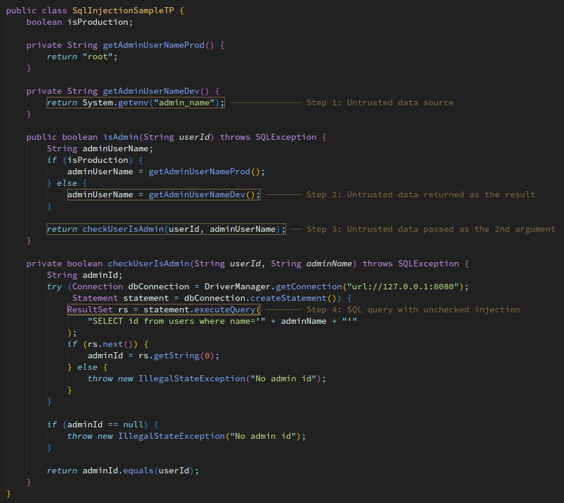
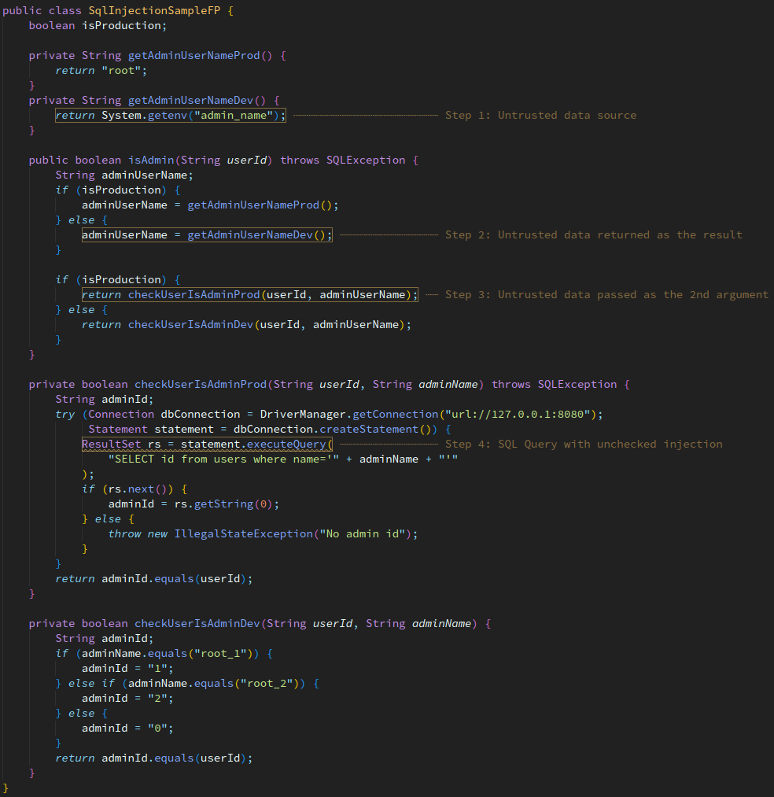

# What is USVM?

USVM is a powerful symbolic execution core designed for analysis of programs in multiple programming languages. Symbolic execution is known to be a very precise but resource demanding technique. USVM makes it faster, more stable, and versatile.

USVM main features include

* extensible and highly optimized symbolic memory model
* optimized constraint management to reduce SMT solver workload
* improved symbolic models for containers (`Map`, `Set`, `List`, etc.)
* targeted symbolic execution
* solving type constraints with no SMT solver involved
* bit-precise reasoning
* forward and backward symbolic exploration

# How can I use it?

With USVM, you can achieve completely automated
* [static code analysis](#taint-analysis-with-usvm),
* [unit test cases generation](#usvm-for-unit-test-generation),
* [targeted fuzzing and more symbolic execution based solutions](#using-usvm-to-confirm-sarif-reports).

Right now, we have ready-to-be-used implementation for [Java](https://github.com/UnitTestBot/usvm/tree/main/usvm-jvm) and experimental implementation for [Python](https://github.com/UnitTestBot/usvm/tree/main/usvm-python).

# Taint analysis with USVM

USVM supports interprocedural condition-sensitive taint analysis of JVM bytecode. For instance, it is able to automatically find the following SQL injection:


By default, USVM is able to find other problems:
* null reference exceptions,
* out-of-bounds access for collections,
* integer overflows,
* division by zero.

You can also extend its analysis rules by [writing custom checkers](#writing-custom-checkers).


You can run USVM in your repo CI by configuring the [ByteFlow](https://github.com/UnitTestBot/byteflow) runner. 

## About condition-sensitive analysis

If we modify the above program a little, things change drastically:


All interprodecural dataflow analysers we've tried report the similar warning for this program. However, this is false alarm: untrusted data is read only in development mode (that is, when `production` field is false), but the real database query happens only in production mode.

The reason why the existing analysers are wrong is the lack of condition-sensitive analysis: they simply do not understand that untrusted data is emitted only under conditions that prevent program from getting into `checkUserIsAdminProd` method. 

The major reason for this is that condition-sensitive analysis is complex and expensive. USVM makes condition-sensitive analysis robust and scalable. In particular, USVM does not report warning in this program.

You can run the this example online in our [demo repository](https://github.com/unitTestBot/byteflow/security/code-scanning).

# Writing custom checkers

USVM allows to customize its behaviour by writing custom analysis rules. To achieve this, USVM can share its internal analysis states into the attached *interpreter observers*. So the first step to write a custom checker is to implement [`JcInterpreterObserver`](https://github.com/UnitTestBot/usvm/blob/b6ed4682063f1ff6008b3f3c8aa15be663706c74/usvm-jvm/src/main/kotlin/org/usvm/machine/JcInterpreterObserver.kt) interface. This observer can be attached to symbolic machine [in its constructor](https://github.com/UnitTestBot/usvm/blob/b6ed4682063f1ff6008b3f3c8aa15be663706c74/usvm-jvm/src/main/kotlin/org/usvm/machine/JcMachine.kt#L35C17-L35C36).

Now, before every instruction gets symbolically executed, the symbolic engine will notify the observer about the next instruction. For instance, if the engine has reached the `throw` instruction, the attached observer will recieve the corresponding event:
```kotlin
fun onThrowStatement(simpleValueResolver: JcSimpleValueResolver, stmt: JcThrowInst, stepScope: JcStepScope)
```

Here, `stmt` represents the instruction which was proven to be reachable. If, for example, your analysis looks for reachability of `HorrificException`, you can look into type of `stmt.throwable`.

The internal state of the analysis is stored into `stepScope`. In fact, your checker gets the representation of the whole program state in the branch that reaches `stmt`. You can query the arbitrary data stored into state or even modify it (allocate new information or modify the existing) using `stepScope.calcOnState`. For example, to allocate new memory fragment in program state, you can write
```kotlin
stepScope.calcOnState { memory.allocateConcreteRef() }
```

You can compute the validity of arbitrary logical predicates on state. Warning: this can cause queries to SMT solver, which can be time and memory demanding. To query the validity, you can write
```kotlin
stepScope.calcOnState { 
	clone().assert(your condition)?.let {
		... handling case when condition is satisfiable ...
	}
}
```

To form and report warnings in SARIF format, use [built-in reporters](https://github.com/UnitTestBot/jacodb/blob/e61c2fa41533a2f0a39fad0beb220c3350987345/jacodb-analysis/src/main/kotlin/org/jacodb/analysis/sarif/DataClasses.kt#L137).

You can browse the [existing checkers](https://github.com/UnitTestBot/usvm/blob/b6ed4682063f1ff6008b3f3c8aa15be663706c74/usvm-jvm/src/main/kotlin/org/usvm/api/targets/TaintAnalysis.kt) for more examples and details.

# Using USVM to confirm SARIF reports

In lots of cases, the exising static code analysers [report false alarms](#about-condition-sensitive-analysis). USVM has ability to confirm or reject the reported warnings. 

To run USVM in trace reproduction mode, configure one of the [analyses](https://github.com/UnitTestBot/usvm/blob/saloed/usvm-demo/usvm-jvm/src/main/kotlin/org/usvm/api/targets/TaintAnalysis.kt) and [pass a set of traces](https://github.com/UnitTestBot/usvm/blob/a1e931e5e51f463ed4a33009cee1ffa01cd375bd/usvm-jvm/src/main/kotlin/org/usvm/api/targets/TaintAnalysis.kt#L29) into [JcMachine](https://github.com/UnitTestBot/usvm/blob/main/usvm-jvm/src/main/kotlin/org/usvm/machine/JcMachine.kt).

Also, this process can be customized by a [rich set of options](https://github.com/UnitTestBot/usvm/blob/main/usvm-util/src/main/kotlin/org/usvm/UMachineOptions.kt).

# USVM for unit test generation

USVM has ability to discover all possible behaviours of a program. This is a key feature used in white-box test generation engines. In future, USVM will be the default code analysis engine in [UnitTestBot for Java](https://github.com/UnitTestBot/utbotjava).


# Other languages support in USVM

[USVM.Core](https://github.com/UnitTestBot/usvm/tree/main/usvm-core) is a framework which provides highly optimized primitives for symbolic execution:
* construction and manipulation with symbolic expressions (based on [KSMT](https://github.com/UnitTestBot/ksmt) platform);
* advanced modeling of [memory operations](https://github.com/UnitTestBot/usvm/tree/main/usvm-core/src/main/kotlin/org/usvm/memory);
* efficient [constraint managenent](https://github.com/UnitTestBot/usvm/tree/main/usvm-core/src/main/kotlin/org/usvm/constraints) and [constraint solving](https://github.com/UnitTestBot/usvm/tree/main/usvm-core/src/main/kotlin/org/usvm/solver);
* rich set of [search strategies](https://github.com/UnitTestBot/usvm/tree/main/usvm-core/src/main/kotlin/org/usvm/ps) in giant branching spaces;
* special support of [standard collections](https://github.com/UnitTestBot/usvm/tree/main/usvm-core/src/main/kotlin/org/usvm/collection);
* special support of [type system](https://github.com/UnitTestBot/usvm/tree/main/usvm-core/src/main/kotlin/org/usvm/types) constraints;
* collection and reporting of [statistics](https://github.com/UnitTestBot/usvm/tree/main/usvm-core/src/main/kotlin/org/usvm/statistics).

Thus, USVM.Core implements common primitives used in programming languages. This makes much easier instantiating USVM for new programming language: in fact, to support a programming language, you only need to write its interpreter in terms of operations provided by USVM.Core.

If you want to support a new language, please take a look at [sample language support](https://github.com/UnitTestBot/usvm/tree/main/usvm-sample-language) in USVM.