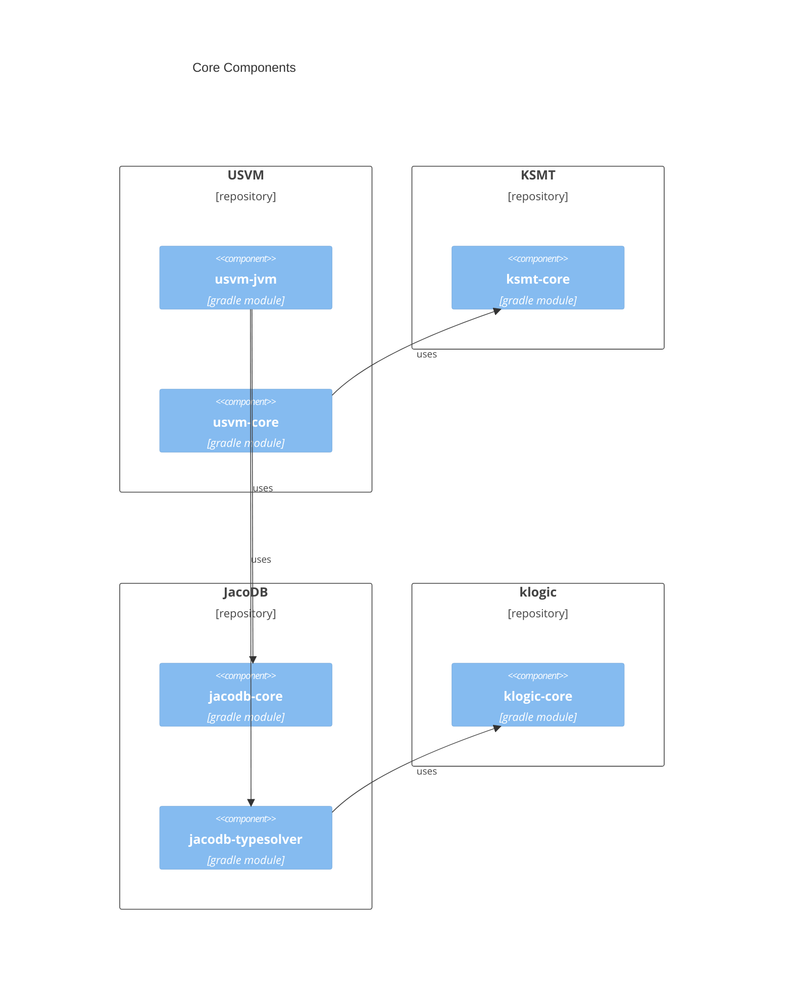

# 25 April 2023

## Solvers

USolver consists of three solvers:
- UEqualitySolver
- UTypeSolver
- KSolver (SMT solver)

USolver splits path constraints and orchestrates solvers.

## Components Diagram

