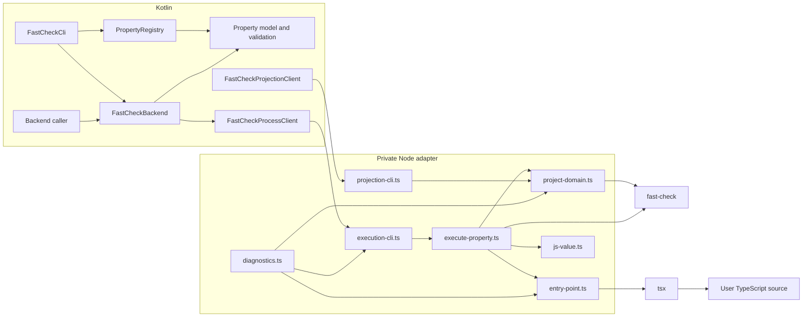
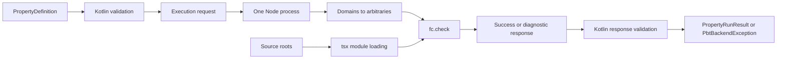
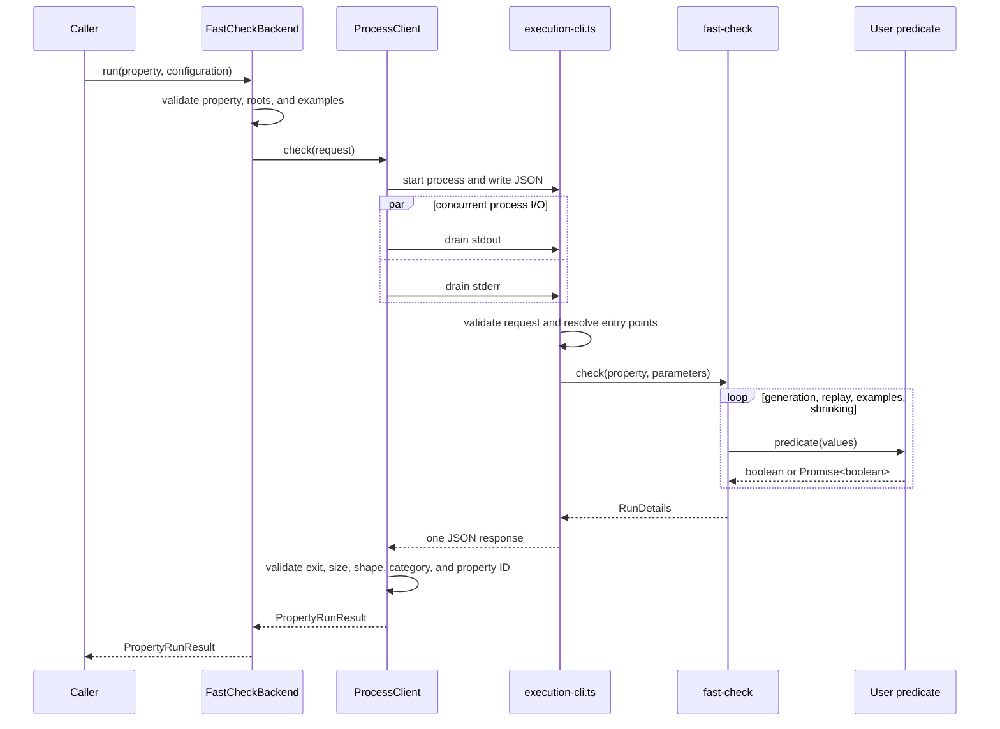
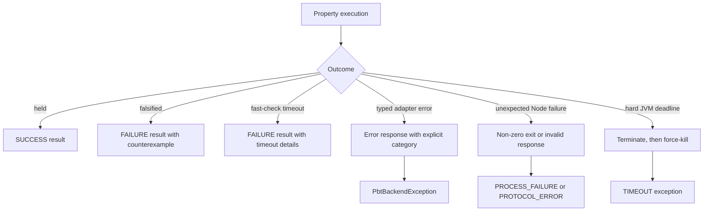

# Kotlin–TypeScript fast-check integration

This document describes the internal boundary between Kotlin and the private Node adapter. For the public property
API and CLI examples, see [README.md](README.md).

## Design goals

- Kotlin owns property definitions, validation, registries, orchestration, and public results.
- Node is a thin adapter around fast-check and direct TypeScript loading.
- The JSON exchange is one request and one response from the same packaged distribution; it has no persistence or
  compatibility negotiation.
- Failures are typed without exposing runtime-dependent Node stack traces.
- A blocked or noisy child process cannot hang the JVM or exhaust unbounded memory.

## Components and dependencies



| Component | Responsibility |
| --- | --- |
| Kotlin model and validation | Define one backend-neutral property and reject invalid structure before execution. |
| Registry and CLI | Select Kotlin-defined properties and turn user options into a run configuration. |
| `FastCheckBackend` | Validate examples, resolve source roots, and create the adapter request. |
| `FastCheckProcessClient` | Supervise Node, bound I/O, enforce the hard deadline, and validate the response. |
| `execution-cli.ts` | Read one JSON request, protect protocol stdout from user logging, and write one response. |
| `execute-property.ts` | Build the fast-check property, run it, and translate `RunDetails` into the common result. |
| `project-domain.ts` | Translate domain descriptors into real `fc.Arbitrary` instances. |
| `entry-point.ts` | Resolve exactly one module below a source root and invoke its typed export through `tsx`. |
| Value and diagnostic modules | Preserve JavaScript values losslessly and define adapter-emitted diagnostic identifiers. |

`projection-cli.ts` is the smaller sampling path used by `FastCheckProjectionClient`. It shares domain and value
translation with property execution but does not load or call user predicates.

## Boundary contract



The execution request contains `manifest`, `sourceRoots`, optional `seed` and `replayPath`, `numRuns`,
`timeoutMillis`, and tagged `examples`. A response is either:

```text
{ status: "ok", result: PropertyRunResult }
{ status: "error", diagnostics: [{ kind, code, message, path }] }
```

There is intentionally no request ID, operation name, schema version, protocol version, backend ID, or backend
version. The exchange is private, one-shot, and produced and consumed by the same build. Adding compatibility
metadata would create branches that no supported workflow uses.

Kotlin validates trusted model objects and examples early so callers get local errors. Node validates the decoded
JSON again because the process boundary must not trust malformed input. Diagnostic codes have one owner per
language: `PbtDiagnosticCode.kt` for Kotlin and `diagnostics.ts` for Node. Node also sends the diagnostic category,
so Kotlin never infers error meaning from code prefixes.

## One property run



Input order is preserved from `PropertyDefinition.inputs` to the positional TypeScript arguments. If either the
predicate or precondition is asynchronous, the adapter uses `fc.asyncProperty`; otherwise it uses `fc.property`.
A false precondition becomes `fc.pre(false)`, leaving skip accounting to fast-check.

## Results, errors, and timeouts



Falsification and a timeout cleanly reported by fast-check are completed property results. Invalid input,
entry-point failures, process failures, malformed responses, and the JVM hard timeout are infrastructure
exceptions.

The execution client starts stdout, stderr, and stdin work concurrently. Requests and stdout are limited to 4 MiB;
stderr is limited to 64 KiB. These are transport safety bounds, not property-policy limits. The hard deadline is the
property timeout plus two seconds for transport, followed by a 250 ms graceful shutdown before force-kill. The only
run-control maximum is `2^31 - 1` milliseconds because Node timers use signed 32-bit delays; runs, examples, and
replay paths have no arbitrary count or length caps.

## Runtime packaging

Gradle installs pinned adapter dependencies, compiles only the private adapter, and packages `dist/src` plus its
runtime dependencies in the application distribution. User TypeScript stays as source. During repository tests,
Gradle passes the adapter directory through a JVM system property; an installed distribution resolves it next to
the application libraries. Node.js 18.18 or newer is required, and runtime archives carry an OS/architecture
classifier because `tsx` depends on a native esbuild package.

## Testing boundaries

- TypeScript unit tests cover value encoding, domain projection, source-root containment, entry-point contracts,
  fast-check behavior, and the one-document CLI boundary.
- Kotlin unit tests cover the property model, registry, CLI selection, example membership, and response validation.
- Process tests use tiny temporary Node programs only for transport behavior that is difficult to force through
  fast-check: startup failure, non-zero exit, malformed output, explicit diagnostic categories, and hard timeout.
- Backend integration tests execute real uncompiled TypeScript through the packaged adapter, including replay,
  shrinking, explicit examples, preconditions, async predicates, and timeouts.

## Non-goals

- Persisting requests or results, or supporting old wire formats.
- Discovering properties by scanning TypeScript source roots.
- Compiling user TypeScript as part of the PBT workflow.
- Reimplementing generation, replay, skip accounting, or shrinking in Kotlin.
- Recording coverage or other per-run artifacts in this change.
