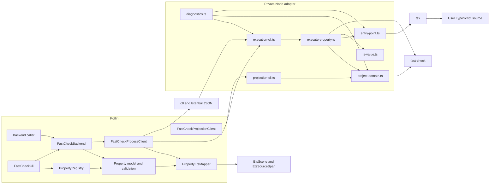
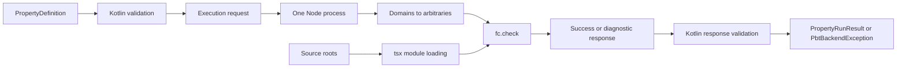
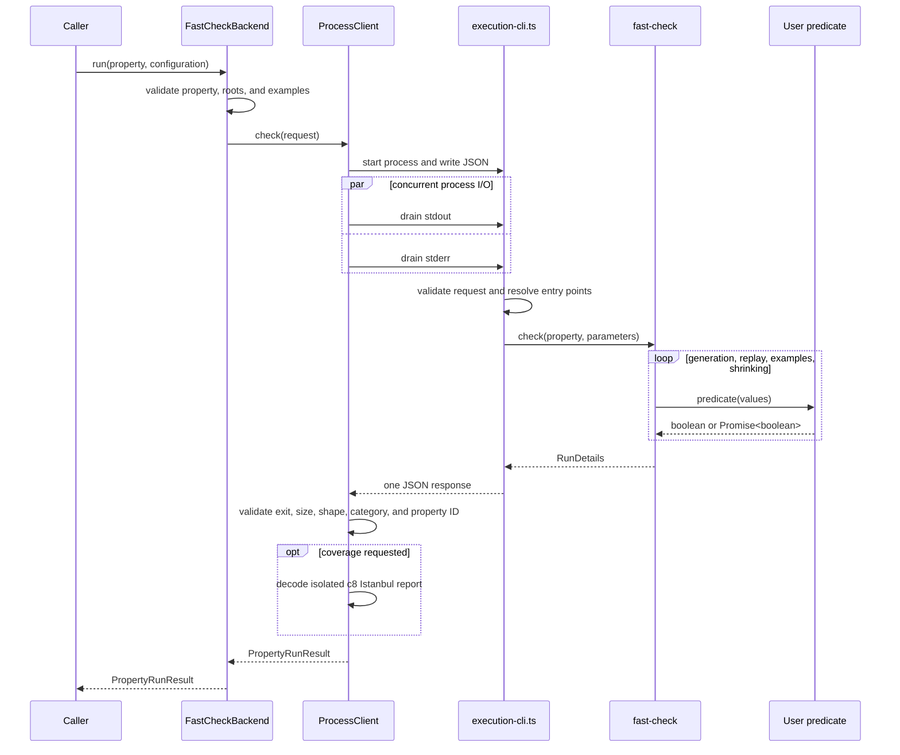
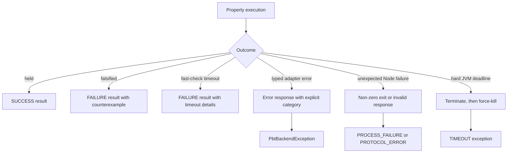

# Kotlin–TypeScript fast-check integration

This document describes the internal boundary between Kotlin and the private Node adapter. For the public property
API and CLI examples, see [README.md](README.md).

## Design goals

- Kotlin owns property definitions, validation, registries, orchestration, and public results.
- Node is a thin adapter around fast-check and direct TypeScript loading.
- Per-property source coverage is an optional backend capability collected by Kotlin through an isolated c8 run.
- A backend-neutral Kotlin mapping layer connects manifests and source coverage to EtsIR without changing the
  declarative property model.
- The JSON exchange is one request and one response from the same packaged distribution; it has no persistence or
  compatibility negotiation.
- Failures are typed without exposing runtime-dependent Node stack traces.
- A blocked or noisy child process cannot hang the JVM or exhaust unbounded memory.

## Components and dependencies



| Component | Responsibility |
| --- | --- |
| Kotlin model and validation | Define one backend-neutral property and reject invalid structure before execution. |
| Registry and CLI | Select Kotlin-defined properties and turn user options into a run configuration. |
| `FastCheckBackend` | Validate examples, resolve source roots, and create the adapter request. |
| `FastCheckProcessClient` | Supervise Node with coroutines and optionally decode one isolated c8 report. |
| `PropertyEtsMapper` | Resolve property entry points and backend-neutral coverage to explicit EtsIR targets. |
| `execution-cli.ts` | Read one JSON request, protect protocol stdout from user logging, and write one response. |
| `execute-property.ts` | Build the fast-check property, run it, and translate `RunDetails` into the common result. |
| `project-domain.ts` | Translate domain descriptors into real `fc.Arbitrary` instances. |
| `entry-point.ts` | Resolve exactly one module below a source root and invoke its typed export through `tsx`. |
| Value and diagnostic modules | Preserve JavaScript values losslessly and define adapter-emitted diagnostic identifiers. |

`projection-cli.ts` is the smaller sampling path used by `FastCheckProjectionClient`. It shares domain and value
translation with property execution but does not load or call user predicates.

## Boundary contract



The private execution request contains `manifest`, `sourceRoots`, optional `seed` and `replayPath`, `numRuns`,
`timeoutMillis`, and tagged `examples`. `coverageRequest` is Kotlin-only transport metadata and is not serialized
to Node or added to `PropertyManifest`. A Node response is either:

```text
{ status: "ok", result: PropertyRunResult }
{ status: "error", diagnostics: [{ kind, code, message, path }] }
```

There is intentionally no request ID, operation name, backend ID, or backend version. The exchange is private,
one-shot, and produced and consumed by the same build. Adding compatibility metadata would create branches that
no supported workflow uses.

Coverage uses the same private protocol. When requested, Kotlin starts the execution CLI under c8, then reads a
separate Istanbul report after a valid response. Backend identity belongs to `coverageCapability` and
`PropertyCoverageArtifact`, not the ordinary property result or private wire response.

Kotlin validates trusted model objects and examples early so callers get local errors. Node validates the decoded
JSON again because the process boundary must not trust malformed input. Diagnostic codes have one owner per
language: `PbtDiagnosticCode.kt` for Kotlin and `diagnostics.ts` for Node. Node also sends the diagnostic category,
so Kotlin never infers error meaning from code prefixes.

## One property run



Input order is preserved from `PropertyDefinition.inputs` to the positional TypeScript arguments. If either the
predicate or precondition is asynchronous, the adapter uses `fc.asyncProperty`; otherwise it uses `fc.property`.
A false precondition becomes `fc.pre(false)`, leaving skip accounting to fast-check.

## Results, errors, and timeouts



Falsification and a timeout cleanly reported by fast-check are completed property results. Invalid input,
entry-point failures, process failures, malformed responses, and the JVM hard timeout are infrastructure
exceptions.

Coverage collection failures use the separate `COVERAGE` infrastructure category. Stable diagnostics distinguish
an unsupported backend or Node runtime, unavailable runtime version, missing collector, missing or malformed
report, and missing or invalid source map. They are never converted into an empty artifact.

## Coverage collection and filtering

For each coverage-enabled property the process client creates unique `raw` and `report` directories and runs:

```text
node <adapter>/node_modules/c8/bin/c8.js
  --config=<run>/c8-config.json
  --reporter=json
  --reports-dir=<run>/report
  --temp-directory=<run>/raw
  --exclude-after-remap
  --allowExternal
  --exclude=__usvm_no_default_excludes__
  node <adapter>/dist/src/execution-cli.js
```

Kotlin first probes the configured Node executable and rejects versions older than 18.18 before creating the c8
workspace. The verified version is reused as artifact provenance. The c8 process inherits the caller's current
directory so user predicates observe the same environment with and without coverage, while an explicit empty
configuration prevents project-local c8 settings from altering collection. c8 then performs V8-to-Istanbul
conversion and source-map remapping. Kotlin rejects reports larger than 64 MiB before
reading them, validates statement, function, and branch maps and counters, classifies remapped files into
source-under-test, property entry points, generated wrappers, or dependencies, then applies include and exclude
globs. Excludes take precedence. Files and diagnostics are sorted deterministically before constructing the
artifact.

A successful or falsified property exits the bridge normally, allowing c8 to flush the report. Process crashes,
invalid protocol responses, and hard kills do not produce a completed property result. The workspace is removed
in all cases, and a new workspace is used for every property.

## Property-to-EtsIR mapping

The mapping layer consumes common Kotlin artifacts only: `PropertyManifest`, optional `PropertyCoverageArtifact`,
an `EtsScene`, and source roots. It does not depend on `FastCheckBackend` or its private runtime representation.
The result is a `PropertyEtsMappingArtifact` that keeps the manifest property ID, backend coverage provenance,
mapping coordinate and branch-order provenance, resolved predicate and precondition targets, coverage targets, and
stable diagnostic reasons.

Entry-point resolution starts from the manifest module/export pair and follows named or bare-star TypeScript
re-exports. Direct function exports resolve only in the file-level `%dflt` class. Namespace-star exports are not
callable methods, bare-star traversal excludes `default`, explicit runtime exports take precedence over bare-star
exports, and duplicate paths to one EtsIR method are deduplicated. Type-alias exports do not mask bare-star runtime
exports. The pinned EtsIR model preserves `isTypeOnly` independently of declaration kind, so type-only named and
star re-exports do not mask a bare-star runtime fallback.
Module candidates mirror the frontend's `.ts`, `.ets`, `.d.ts`, and directory-index suffix rules.
Predicate and precondition resolution are independent. A resolved method carries `EtsEntryPointBindings`: receiver
slot zero, ordered input-to-parameter bindings in subsequent slots, and the result type. A mismatch between
manifest inputs and EtsIR parameters is unsupported, as is coverage carrying another property ID.

Existing source roots and files are canonicalized with real paths; an unresolvable root makes entry-point mapping
unsupported. Istanbul lines are converted from one-based to zero-based, columns stay zero-based, and offsets are
calculated in UTF-16 code units using TypeScript's LF, CRLF, CR, U+2028, and U+2029 line terminators. Statement mapping first looks
for an exact `EtsSourceSpan`; if normalized EtsIR statements share that span, all remain exact targets. A containing
coverage range with one distinct origin is also exact, several distinct origins are ambiguous, and no origin match
is unmapped. Missing source text, invalid coordinates, or an EtsIR file whose statements have no origins are
unsupported.

Branch mapping currently accepts an Istanbul `if` with exactly two ordered arms and resolves conditions to
`EtsIfStmt`. The first CFG successor is recorded as true and the second as false. Several EtsIR conditions with one
shared origin are exact; several distinct condition origins are ambiguous. Other branch types, non-binary arm
shapes, and EtsIR conditions without two ordered successors are unsupported rather than inferred.
An invalid arm is reported independently while a successfully resolved condition remains available, and aggregate
coverage status includes both conditions and arms.

The JVM taint-analysis `PositionResolver` and `ConditionResolver` were reviewed as architectural prior art. Their
useful separation is preserved: declarative receiver/argument/result positions are distinct from runtime-bound
values, and condition interpretation is distinct from position resolution. The TypeScript mapper expresses this
with EtsIR-specific binding and mapping records and has no dependency on `usvm-jvm` or the taint-analysis module.

The execution client starts stdout, stderr, and stdin work concurrently on the coroutine I/O dispatcher. Requests
and stdout are limited to 4 MiB; stderr is limited to 64 KiB. These are transport safety bounds, not property-policy
limits. The hard deadline is the property timeout plus two seconds for transport, followed by up to 250 ms of
graceful shutdown before force-kill, bounded by the absolute deadline. A private supervisor keeps the adapter in an
owned process group and retains a stable worker until cleanup, so an adapter that exits before its descendants cannot
orphan them. The only run-control maximum is `2^31 - 1` milliseconds because Node timers use signed 32-bit delays;
runs, examples, and replay paths have no arbitrary count or length caps.

## Runtime packaging

Gradle installs pinned adapter dependencies, including c8 10.1.3, compiles only the private adapter, and packages
`dist/src` plus its runtime dependencies in the application distribution. User TypeScript stays as source. During repository tests,
Gradle passes the adapter directory through a JVM system property; an installed distribution resolves it next to
the application libraries. Node.js 18.18 or newer is required, and runtime archives carry an OS/architecture
classifier because `tsx` depends on a native esbuild package.

## Testing boundaries

- TypeScript unit tests cover value encoding, domain projection, source-root containment, entry-point contracts,
  fast-check behavior, and the one-document CLI boundary.
- Kotlin unit tests cover the property model, registry, CLI selection, example membership, and response validation.
- Process tests use tiny temporary Node programs only for transport behavior that is difficult to force through
  fast-check: startup failure, non-zero exit, malformed output, explicit diagnostic categories, and hard timeout.
- Backend integration tests execute real uncompiled TypeScript through the packaged adapter, including replay,
  shrinking, explicit examples, preconditions, async predicates, and timeouts.
- Coverage golden tests assert literal TypeScript statement and branch outcomes for successful and falsified runs,
  cross-property isolation, scope and glob filtering, and source-map/report diagnostics.
- Mapping golden tests load stable TypeScript fixtures through the native frontend and cover predicate,
  precondition, re-export, UTF-16 normalization, shared spans, exact/ambiguous/unmapped branches, unsupported
  source data, and backend-without-coverage behavior.

## Non-goals

- Persisting requests or results, or supporting old wire formats.
- Discovering properties by scanning TypeScript source roots.
- Compiling user TypeScript as part of the PBT workflow.
- Reimplementing generation, replay, skip accounting, or shrinking in Kotlin.
- Constructing symbolic inputs or executing mapped properties in USVM.
- Combining backend source coverage with future EtsIR replay coverage.
